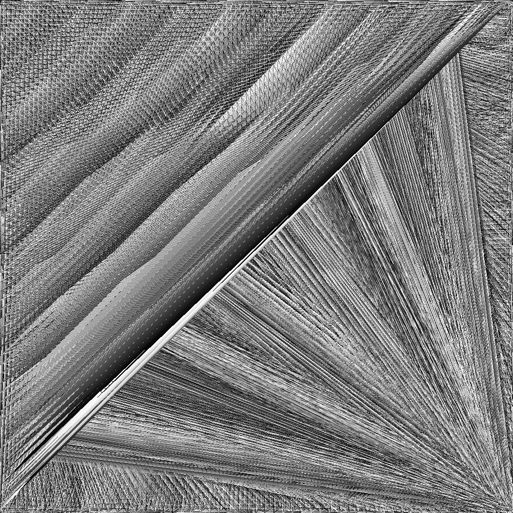

# Artsy

The idea behind *Artsy* is creating art using python scripts. It uses the [bmp](https://en.wikipedia.org/wiki/BMP_file_format) file format to create pixelated (rasty) images.


## Examples

### Cubes


```Python
from artwork import Artwork
from models.pixel import Pixel


def main() -> None:
    length = 1000
    artwork = Artwork(width=length, height=length)
    for x in range(length):
        for y in range(length):
            artwork[x, y] = Pixel(red=x % 255, blue=y % 255, green=0)

    artwork.export("artwork.bmp")


if __name__ == "__main__":
    main()
```

## Lines


```Python
from artwork import Artwork
from models.pixel import Pixel


def main() -> None:
    length = 1000
    artwork = Artwork(width=length, height=length)

    count = 0
    for x in range(length):
        for y in range(length):
            artwork[x, y] = Pixel(
	            red=count % 255, 
	            green=count % 255, 
	            blue=count % 255
	        )
            if (x + y) % 7 == 0:
                count += 1

    artwork.export("artwork.bmp")


if __name__ == "__main__":
    main()
```

## Triangles



```python
from artwork import Artwork
from models.pixel import Pixel


def main() -> None:
    length = 1000
    artwork = Artwork(width=length, height=length)
    iteration = 0
    for x in range(length):
        for y in range(length):
            v1 = (7 * (x + y) % 1000, 7 * (x - y) % 1000)
            v2 = (3 * (x + y) % 1000, 3 * (x - y) % 1000)
            v3 = (9 * (x + y) % 1000, 9 * (x - y) % 1000)
            color = Color(iteration % 256, iteration % 256, iteration % 256)
            artwork.line(p0=v1, p1=v2, color=color)
            artwork.line(p0=v2, p1=v3, color=color)
            artwork.line(p0=v3, p1=v1, color=color)
            iteration += 1
    artwork.export("artwork.bmp")


if __name__ == "__main__":
    main()
```
